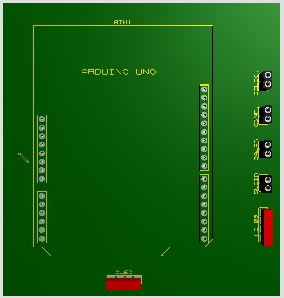

# Keypad.
## Introduction.
En este informe se mostrará y describirá todo lo cumplido por el alumno Fabian Martinez Rincon de la Escuela Técnica numero 6 Albert Thomas, en el sector Arduino.
Durante el periodo de prácticas aprenderemos el uso y funciones de las herramientas y módulos que nos brinda Arduino y como aprovecharlas a lo largo de nuestros proyectos.
Vamos a realizar una botonera en el cual mediante dos teclas nos permite subir y bajar en un abecedario y poder elegir letra por letra hasta enviar una frase por bluetooh a nuestro receptor que se encuentra en el lugar deseado por el usuario.En este informe se mostrará y describirá todo lo cumplido por el alumno Fabian Martinez Rincon de la Escuela Técnica numero 6 Albert Thomas, en el sector Arduino. Durante el periodo de prácticas aprenderemos el uso y funciones de las herramientas y módulos que nos brinda Arduino y como aprovecharlas a lo largo de nuestros proyectos. Vamos a realizar una botonera en el cual mediante dos teclas nos permite subir y bajar en un abecedario y poder elegir letra por letra hasta enviar una frase por bluetooh a nuestro receptor que se encuentra en el lugar deseado por el usuario.

## Components.
- Arduino UNO (2)
- LCD OLED I2C 128 x 64 (1)
- LCD 16 x 2 SPI (1)
- Buttons (4)
- Module Bluetooh HC - 06 (1)
- Module Bluetooh HC - 05 (1)
- Transformer 5v (2)
- Buzzer (1)
#### Square 1:1 Component Table.

### General diagram.

### Keypad diagram.

## Desarrollo
Al principio programamos los pulsadores para que mande una palabra escrita por el usuario al puerto serial. Para esto el usuario tiene que navegar por el array
abc a través de los pulsadores letra por letra hasta encontrar la que el desea y cuando termine poder enviarla. El maestro que será el encargado de mandar por
puerto serial estos datos, para que, al momento de ingresar el botón de “terminar palabra”, solo se mande la palabra cargada. Tal y como se muestra en la “figura
10”.

### Circuito con pulsadores y pantalla serial.

Una vez tenemos el circuito que se muestra en la “figura 9”, para comprobar que funciona, ingresamos cierta cantidad de letras para estar al tanto del
funcionamiento (Como se muestra en la figura 10). La letra “ñ” no está en nuestro lenguaje, pero esto lo corregimos más adelante.
En este caso utilizamos el serial para comprobar de que no tenemos errores en el código ya que puede pasar que por errores de conexión tardemos mucho mas
en encontrar el error que si solo utilizamos el puerto serial. A demás, mas adelante nos ayudara ya que sabemos que tiene que mostrar por el display y
que no tiene que mostrar en caso de errores.

### Pantalla serial.

En la “figura 11” se cambian los pulsadores pull down que estábamos utilizando por pulsadores pull up, ya que nos permitía utilizar las resistencias internas del
Arduino y ahorrar en componentes (que en este caso no son necesarias) y el circuito queda mas compacto.

### Esquema de Pulsadores Pull Up.

Para poder utilizar los pulsadores que tenemos en la “figura 11” necesitamos cambiar la configurar de los pines actuales, ya que estaban en configuración pull
down. Para cambiarlos tenemos que configurar los modos en los que Arduino lee los pines (como se muestra en la figura 12), tanto de entrada como de salida.
Para que nosotros lo podamos utilizar, tenemos que tener los pines en el modo IPUT_PULLUP ya que nos permite tener 5v siempre a la salida.
Agregamos los Modulo Bluetooth HC-06 y HC-05 (Como se muestra en la figura 5). En el caso de que solamente tengamos estos módulos en simulación tenemos que crear dos puertos virtuales para que proteus nos permita leer ambos módulos. Utilizamos el programa que se muestra en la “figura 13” para simular estos pines. (Las librerías que utilizamos para los módulos, las dejamos al final del informe).

### Simulador de pines.

Una vez que terminamos de armar el código y de poder configurar todos los pines necesarios para poder utilizar los módulos bluetooh en proteus, acomodamos las conexiones tanto de los pulsadores, como de los módulos para poder utilizarlo desde ambas pantallas serial. En la “figura 14” tenemos tanto el receptor como el emisor. Y en la “figura 15” tenemos una imagen que nos muestra como es el funcionamiento en ambas pantallas serial.

## Circuito con pulsadores imprementados.

## Circuito con puertos serial en simulación.

En la “figura 15” imagen tenemos al circuito funcionando y mostrando como se vería en el seria al enviarse una palabra completa. Utilizamos el guion como
símbolo de “espacio”. Una vez que se envía la palabra se reinicia. En la “figura 16” se muestra el que código del pulsador “BAJAR”, en lugar de
usar un “delay ()” que es una función bloqueante, utilizamos un contador, el numero en contadorB es 10000 ya que el pulsador iba mas lento que el recorrido
del mismo y volvía a ejecutar otra letra. Es por eso que ese es el valor mínimo.

## Configuración de Pulsadores.

### Arduino Maestro
Por parte del circuito del Arduino maestro, en la “figura 16“se muestra como quedo luego de ingresar el oled que utilizaremos como interfaz y menú para el
cliente. En el lcd que se muestra en la “figura 16” se muestra la interfaz y a medida que nosotros pulsamos los interruptores, podemos movernos entre las opciones del menú que hemos cargado con anterioridad.

## Ensamble completo del Arduino maestro.

## Circuito Impreso Arduino maestro.

Tenemos el circuito impreso mostrado en la figura 17 en caso de que vayamos a montarlo o que mandemos a hacer la plaqueta pcb. También hicimos el modelaje de la plaqueta en 3D para que el usuario que arme el circuito tenga una visión mas amplia de como quedaría una vez completado. Tal y como se
muestra en las “figuras 18 y 19”

## Parte trasera de la placa.

## Parte delantera de la placa.

Tuvimos que utilizar un Jumper ya que no se nos presento otra forma de completarlo.

## Diagrama de flujo Arduino esclavo.

### Arduino Esclavo.
Una vez que tenemos el maestro procedemos a instalar y programar el Arduino esclavo, como se muestra en la “figura 21”, este mismo nos servirá como un
receptor por el que el Arduino maestro mande una palabra escrita por el usuario y muestre en el lcd que tengamos conectado este mismo Arduino y que pueda
alertar de que llego una frase.

## Ensamble del Arduino esclavo.

El circuito impreso de Arduino esclavo se muestra en la imagen de la “figura 22”, tenemos tanto el Arduino como el display de 16x2.

## Circuito impreso Arduino Esclavo.

### Circuito impreso en 3d del Arduino esclavo.
Para tener una visión de cómo quedaría el circuito ya montado, procedemos a mostrar el circuito en 3d tal y como se muestra en las imágenes de la “figura 23” y ”24”.

## Impreso trasero.

## Impreso delantero.

## Simulación en Proteus.

En la figura “figura 25” tenemos imágenes de lo que es la simulación en proteus por parte del Arduino esclavo y en la figura 12.1 tenemos otra imagen de la simulación, pero en esta ya se eligió la opción de confirmar la opción demandada.

### Oled Confirmando Opción.

Lo primero que hacer es guardar la opción 1 ya que tenemos un array en el que vamos guardando las palabras que vamos escribiendo. Si ingresamos otra vez
a nuestro circuito, ya tendríamos las opciones cargadas por la eeprom. Cuando cargamos las opciones, nos quedaría de la forma en la que se encuentra en la
imagen de la “figura 26"

### Oled eligiendo slot.

Acá, independientemente de la opción que se elija, ya la podemos mostrar tanto por el display como por el serial de cómo se muestra en las imágenes de la “figura 27” y “figura 28

## Terminales del Emisor y Receptor.

En la “figura 29” se muestra cómo se vería el mensaje enviado a través del Arduino maestro en el Arduino esclavo

## LCD Receptor.

Una vez terminado el display del Arduino esclavo como se muestra en la “figura 29“procedemos a conectar en el Arduino maestro el display principal, con este mismo controlaremos el menú principal en donde nuestro cliente podrá insertar las opciones y luego guardarlas, con una interfaz en la que muestra el nombre del colegio. El esquema final sería el que se muestra en la “figura 30

## Ensamblaje Final del Proyecto.

### Conclusión
En la primera parte del trabajo nos dedicamos al armado básico del Arduino
maestro (Los pulsadores más los monitores serial), en este mismo programamos
para que el cliente pueda ingresar palabras a su comodidad y mandarlas al menú
principal. Por parte del receptor, tenemos un Arduino esclavo el cual se encarga
de cargar la frase que fue cargada por el Arduino maestro y mandarla al segundo
display de 16x2, en este mismo se mostrara el mensaje enviado por el cliente.
Al finalizar el proyecto, pudimos terminar con todos los objetivos planteados ya
que cumple con todos los requerimientos necesarios, para el funcionamiento
básico del circuito.

### Mejoras
- Hacer una api para controlar los pulsadores
- Aumentar la velocidad de lectura de teclas
- Pulir la interfaz de usuario
- Tener alimentación para ambos Arduinos

